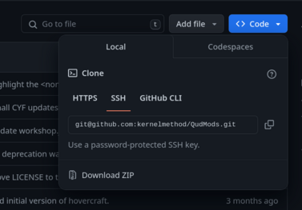

**This repository is no longer maintained. The current repository is:**

> https://gitlab.com/kernelmethod/qudmods/

---

# kernelmethod's mods for Caves of Qud

This is the main repository for all of my mods for [Caves of
Qud](https://www.cavesofqud.com/).

## Installation

The [Caves of Qud
wiki](https://wiki.cavesofqud.com/wiki/Modding:Installing_a_mod) has
instructions for installing mods from source code. In general, to install a
given mod you will need to copy a folder from this repository into the correct
directory using the following steps:

- Download the code in this repository as a ZIP file by pressing the
  `<> Code v` button and then pressing `Download ZIP`.



- Unzip the `QudMods-main.zip` file that you downloaded. The unzipped folder
  should contain all of the mods in this repository, for example:

```
QudMods-main
├── BetterPetSelector
├── ChooseYourFighter
├── ChooseYourFighterLegacy
├── CrungleMode
├── EasierFungalCures
...
```

- Locate the "offline mods" folder for your installation of Caves of Qud. You
  can find this on [file
  locations](https://wiki.cavesofqud.com/wiki/File_locations) page of the Caves
  of Qud wiki.

- Locate the folder corresponding to the mod you want to install. **It is
  important that you locate the correct subfolder, and not its parent folder.**
  This subfolder is always contained in another folder with the same name. For
  example, the following diagram shows how the `QudMods-main/EasierFungalCures/`
  folder is structured. The folder you will need to copy in the next step is
  `QudMods-main/EasierFungalCures/EasierFungalCures`.

```
QudMods-main
└── EasierFungalCures
    ├── EasierFungalCures
    │   ├── manifest.json
    │   ├── ObjectBlueprints.xml
    │   ├── Preview.png
    │   └── workshop.json
    ├── Preview.jpg
    └── README.md
```

- Copy the contents of the subfolder for the mod you want to install into your
  offline mods directory.  Using the example of the EasierFungalCures mod again,
  this is how the directory structure of your offline mods folder should look at
  the end of this step:

```
Mods
└── EasierFungalCures
    ├── manifest.json
    ├── ObjectBlueprints.xml
    ├── Preview.png
    └── workshop.json
```

- Launch the game. Ensure that you have mods enabled in your settings. You
  should now see the mod installed in your `Installed Mod Configuration`.
