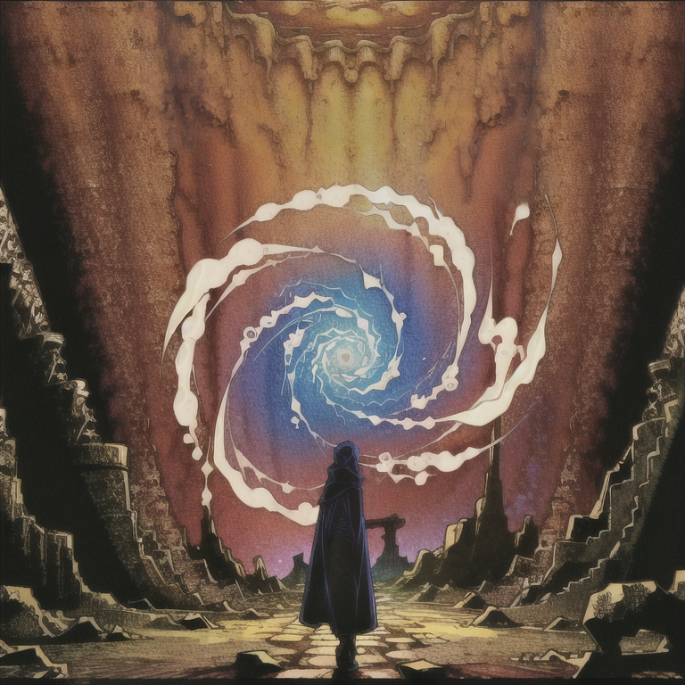

# Riftwalker

- Cornered?
- Tough enemy in the way?
- Barrier blocking your path?
- Bored, and looking for a way to instantly teleport 25 strata below Qud?

*Just space-time vortex your problems away!*

Riftwalker is a small Caves of Qud mod to increase the viability of Space-Time
Vortex-oriented builds. It is partially inspired by the [Improved Space-Time
Vortex mod](https://steamcommunity.com/sharedfiles/filedetails/?id=1445153212).

## Features

- Adds the Escape Rift mental mutation, which spawns a space-time vortex at the
  player's current cell.
- Vortices spawned by the Space-Time Vortex mutation now spawn at the location
  selected by the player (rather than a random adjacent tile). The mutation
cost of Space-Time Vortex is slightly increased. This change _only_ applies to
the player, not to NPCs that use Space-Time Vortex.

**Warning:** this mod makes a few different changes to the behavior of the
Space-Time Vortex mutation. These changes may interfere with other mods you
have installed that also alter the behavior of this mutation.

## Installation

If you're playing Caves of Qud through Steam, you can install this mod by
subscribing to it on its [Steam Workshop
page](https://steamcommunity.com/sharedfiles/filedetails/?id=2992397788).

If you're playing Qud through a different source (e.g. from Itch), you should
follow the [manual installation
instructions](https://wiki.cavesofqud.com/wiki/Modding:Installing_a_mod#Manual_Download)
on the Qud wiki. In this case, you should [download this repository as a zip
file](https://github.com/kernelmethod/Riftwalker/archive/refs/heads/main.zip)
and copy the `Riftwalker/` subdirectory as described on the CoQ wiki.

## Recommended builds

### Riftwalker esper

An esper build utilizing Escape Rift and Space-Time Vortex to provide various
vortex-based options for defense and exploration.

```
H4sIAAAAAAAAA81WUY/SQBB+v1+xaXwshLuQy8XkHpAjagSDgGhi7mHbju3G7W6zO3uKhP/ubMthW1Q8E0xJKOX7Zr/9mJkdur1gLEh5Dg9grNAqeM6Cq/6gfzUY9m+ug9DTkRMyqfGXxA8qKteJk2AJ/URfGduW1wOx2hTgV3xcTPvjjBseI5gXXs7237nEv1+C0khhs3JByEbWQh7JTW+8pAVFyNbVxrc/XYVs7CQ6A7cKHBouQzZ3kRTxG9is9BdQt8pJWRosvSQcObl49EbIM3yqsTvSODJ32IIkH8O96swhR0jYK5dzVQ86SuKe2pWfu/Afc7h0USdT2PB1MoP7aK85FzI1Iv8PqStLRbq2c8lrOTuZvrwgwUENsCAhLhUOx7N6bWv3bN+t+9RObAGmploGjLVTSOxlC19zI3jJDFrMQ8W8pbniVYMauwv/zsl7ZZFHEpg/WCTTBU8TG/MC2EJ8xk74mYo0QzbjShROVmgXbC0LHkNvJXJga20QvnXDlY4Fl3LDFlC4VPl9zmrrcH9//ik2QjQicgjdG2Ntayfn2FwLhXbuTJxxC0ljR/8vgQZUihnhw3o1glEqpMAN4dcNfKVdmimwfgreNJjXCkFKkYKK4WjZByFlob/SNKSGaNQ9mKTaax2gWgcGvFgWUPZKbzhs4AvIuVBCpa0xHdGvHPnZ3Yg/U6OMnUWdi+9w4DvXML+zeLJxVHUKvYcaWgAeg1TypKxsO9hoRUNg+as156pIprWFJXKD1BtTHZcDq3tV+YPN0092rWV+rzuwYHDM1YYeUNZ02HgKT3jeo+v9xe4HdSc6eL4MAAA=
```



